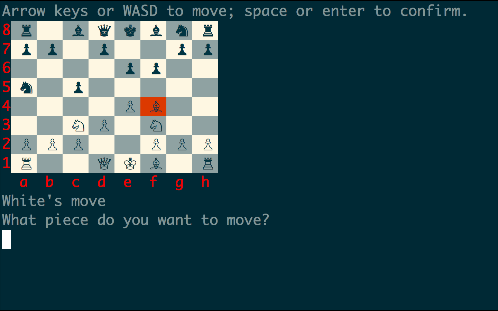

# Chess AI



Chess game playable in the terminal. Computer player uses a minimax algorithm. Built entirely in Ruby.

## Directions
Run `ruby game.rb` in the command line.

For two-player game, change `ComputerPlayer` to `HumanPlayer` in `game.rb`.

## Object Oriented

There are classes for each piece, and each piece inherits from a `Piece` class. `Slideable` and `Steppable` modules are used to keep the code DRY. `Queen`, `Rook`, and `Bishop` classes area `Slideable`; `King` and `Knight` are `Steppable`.

Empty squares use a `EmptySquare` singleton instance.

## Computer AI

The [minimax](https://en.wikipedia.org/wiki/Minimax) algorithm is used for computer moves. Alpha-beta pruning is used to optimize performance. By default, the computer searches to a depth of 2 plies.

```Ruby
# computerplayer.rb

def minimax(node, depth, alpha = -Float::INFINITY, beta = Float::INFINITY, maximizing_player = true)
  if depth == 0 || node.children.empty?
    return node.value = node.evaluate
  end

  if maximizing_player
    best_value = -Float::INFINITY

    node.children.each do |child|
      child_value = minimax(child, depth - 1, alpha, beta, false)
      best_value = [best_value, child_value].max
      alpha = [alpha, best_value].max
      break if beta <= alpha
    end
  else
    best_value = Float::INFINITY

    node.children.each do |child|
      child_value = minimax(child, depth - 1, alpha, beta, true)
      best_value = [best_value, child_value].min
      beta = [beta, best_value].min
      break if beta <= alpha
    end
  end

  node.value = best_value
end
```
